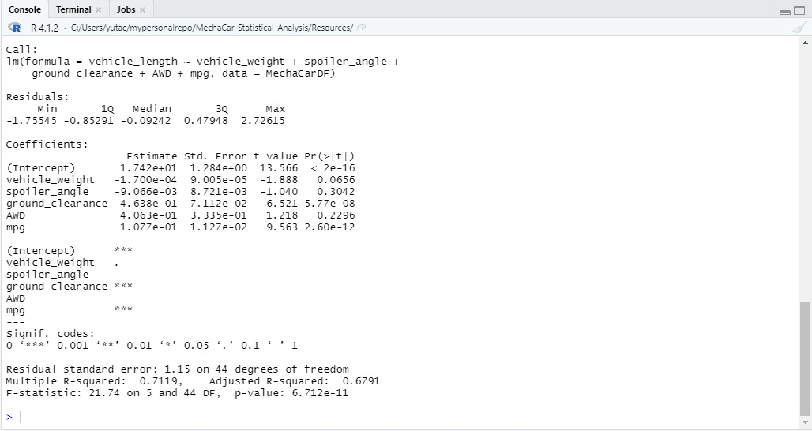
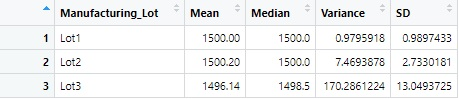
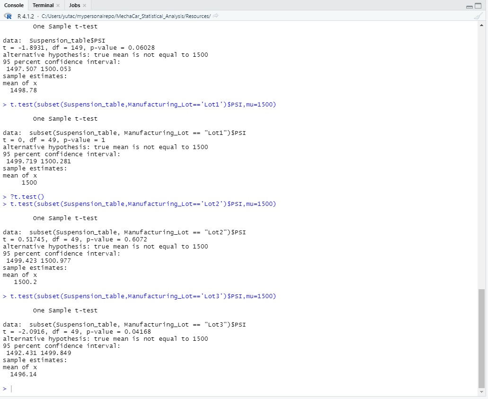

# MechaCar_Statistical_Analysis

## Linear Regression to Predict MPG
     MPG and ground_clearance were the least likely to provide random amounts of variance to
the model that we have constructed. If we were to assume that our significance level was 0.05,
we would be able to reject the hypothesis that our slope is zero. To sum it up, we would be
able to declare that the slope of our model is not zero. In order to answer if the model is
able to predict the mpg of MechaCar pro effectively would be to understand to which values
is acceptable for the strength of correlation. If the range of the adjusted R-squared value
between 0.5 and 0.7, we would say that the model is able to predict the mpg effectively.
However, if it were to be greater than 0.7, it would not predict the mpg effectively since
the value does not make it to the threshold value of a strong correlation.

## Summary Statistics on Suspension Coils
     With the requirement that the variance of the suspension coils must not exceed 100 pounds
per square inch, the current manufacturing design specification does not meet the requirements.
However, Lot1 and Lot2 of the manufacturings lots do meet the requirements. It is Lot3 that
does not meet the standard with a value of over 100 for its variance.

## T-Tests on Suspension Coils
     We find that when determining if PSI across all manufacturing lots are statistically
similar from the population mean of 1500 pounds per square inch. Additional t-tests were
performed to see if the PSI across different manufacturing lots were statistically similar
from the poopulation mean of 1500 pounds per square inch as well. The yielded results were
that lots 1 and 2 were statistically similar but lot 3 was not because of its p-value being
lower than the assumed 0.05 significance level.

## MechaCar vs Competition
     A statistical study that could be done between MechaCar vs Competition that could be
done would be to compare the metrics of mpgs, cost, as well as maintenance cost. The study
would be done on the front that the car may be a little bit more on the expensive side, but
comes with the benefits of low maintenance cost and with greater mpg than its competition.
To test these metrics multiple linear regression would be done on both MechaCar and Competition.
The null hypothesis would be that the slope would be zero and the alternate hypothesis would
state that the slope is not zero. If the p-values are less than 0.05 we would be able to state
that the slope is not zero. We would then be able to compare the r-squared values which would
provide us some values to compare the relationships between the metrics of MechaCar and its
competition allowing us to make some statements regarding the cars. Another interesting way
to test the metrics between the two would be to understand the correlation coefficients as well.
We would able to create the matrices for both MechaCar and Competition with the metrics which
may guide in a direction to better understand the value of the correlation coefficients.
